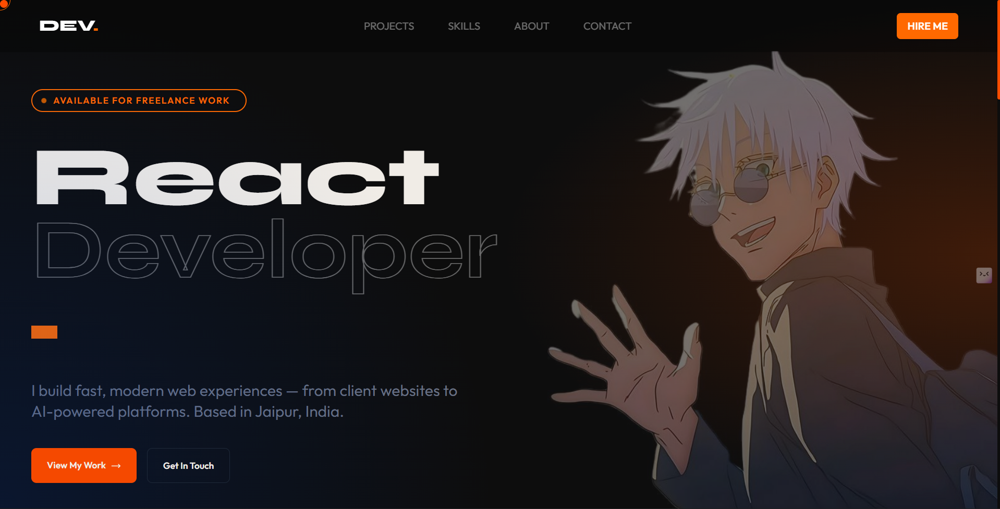

# DEV. — Personal Portfolio

> Personal portfolio of **Dev Hada** — React Developer based in Jaipur, India.
> Built from scratch with React, Tailwind CSS v4, and Framer Motion.

🔗 **Live:** [devhada.vercel.app](https://devhada.vercel.app)

---

## About

I'm a final-year BCA student who builds and ships real products — not just tutorial projects.
This portfolio was designed and developed entirely by me, featuring live client work, a hackathon team project, and personal builds.

---

## Tech Stack

| Technology      | Purpose                         |
| --------------- | ------------------------------- |
| React + Vite    | Frontend framework & build tool |
| Tailwind CSS v4 | Utility-first styling           |
| Framer Motion   | Page & scroll animations        |
| Swiper.js       | Projects carousel               |
| EmailJS         | Contact form email delivery     |
| Vercel          | Deployment & hosting            |

---

## Features

- Custom animated cursor with hover state detection
- Framer Motion scroll-triggered animations on every section
- Fully working contact form powered by EmailJS
- Swiper.js project carousel with responsive breakpoints
- Resume download from About section
- Mobile responsive across all sections
- Touch device cursor detection — custom cursor hidden on mobile

---

## Sections

- **Navbar** — Fixed top bar with scroll blur effect and Framer Motion entrance
- **Hero** — Bold headline, Gojo aesthetic, animated CTA buttons
- **Projects** — Client, team & personal projects with category badges
- **Tech Stack** — Grouped skill cards by category
- **About** — Bio, stats grid, resume download
- **Certificates** - Courses and certifications I've completed.
- **Contact** — Social links + working EmailJS form
- **Footer** — Minimal with Google Maps link

## Run Locally

```bash
git clone https://github.com/devHada/My-Portfolio
cd My-Portfolio
npm install
npm run dev
```

## Environment Variables

Create a `.env` file in the root:

```
VITE_EMAILJS_SERVICE_ID=your_service_id
VITE_EMAILJS_TEMPLATE_ID=your_template_id
VITE_EMAILJS_PUBLIC_KEY=your_public_key
```

> Add the same variables in Vercel dashboard under **Settings → Environment Variables** before deploying.

---

Built with ❤️ by Dev Hada. Shinzou wo Sasageyo 🗡️

---

## Preview


